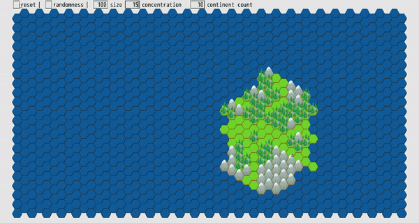
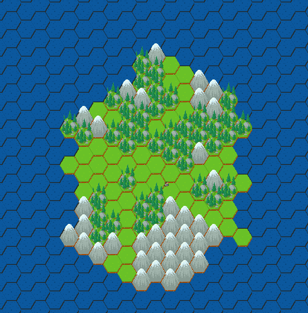

# Hexmap Generator
---------------------

## Remarks

This project was done for my CSU Chico Senior Project. I have a passion for hex based 4x games and procedural generation. This was my first go at making a procedural hexmap, while learning a new language.

The language I learned while in development was Ruby. I used the DragonRubyGTK, which is currently being developed to create 2D games in Ruby.
  

## Generation 
----------------------

The map is generated by starting with one hex and building up around that one hex. After that hex has discovered hexes surrounding it and then added to a queue, it will then pop the next hex from that queue.

Once a continent (One hexagonal mass) is complete it will make it somewhat iragular. It does this by dropping pieces near the edges of the continent. This gives the continent some more character.

There are three types of terrain plains, hills, and mountains. There is a leveling system where if the current level is a certain number, it will be that terrain type.

* Plains = 0 (Chances of this are high)
* Hill = 1 (medium chance)
* Forest = 2

There are a few inputs you as a user can influence the generation.

* size
* concentration
* continent count
* randomness

## Size

The size attribute will define the max possible size of a continent.
 

## Concentration

The concentration attribute helps define the number that will be asserted to see if the hex in question will be filled by a land tile.
 

## Continent Count

How many continents will go through the generation process.
 

## Randomness

Turns off the randomness including what concentration does, but the wrap up when the program takes away some pieces will still run. In retrospect, this should be renamed.

## Text Boxes
---------------

To make editing number variables in the toolbar, I created a text box. This text box can be edited somewhat similarly to most text inputs. It is lacking some features such as, when you click in the box the cursor will always begin at the end of the value. You still can use the arrow keys to move the cursor to a spot you want to edit. This was a fun addition I made to help people play with the variables. The old version had a ticker and you could only tick up or down by one.

## Wanderer (The Little Dudes on the Map)
---------------------------------------------

As a fun little addition I implemented little wanderers who lived on the map. The intention was to have a civilization simulation run on the map. Right now the little wanderer explores all parts of land, but stays off water. Once he moves to another hex, he will linger there until he decides to leave. I did not have time to turn him into his final form, which is a tribe of people.

## Desired Road Map
---------------------

If I ever get to working on this project again or trying out a different approach to generation, I want to add a less formal selection of hexes when developing. One way to do this is instead of just pulling from the front of the queue have a chance of developing off another hex instead. This would make more irregular, but entertainning continents. When you first start up the program you'll find that the generation in realtime is very structured with out any real randomness to the generation. I hope that this new way of generation will work better.

Another improvement I seek to make is the obvious rendering issues. Tiles are rendered poorly and not in the correct way. I should be rendering from the edges in, top to bottom, with this tile set. The tile set has an angle view to it, instead of a top down look. This means that you will be seeing some land underneath the plains, hills, and mountains. Currently they are always visible, which is should be intended only for the edges of a land mass.

My last improvement would be to implement the full civilization simulation. This would be the largest task out of all of them. This would probably be the bases for a 4x game to follow. It is supposed to work similar to Rimworlds generation or Dwarf Fortress. The first step in this endevor would be to write some new tokens (what the wanderer is based off). These tokens would be animals that could be harvested for food and other resources. The wanderers, which will become tribes, would hunt down animals to gather food. When a tribe gathered more food than necessary for a month, they would grow.

These are just a few of the things I would like to do in this project.
